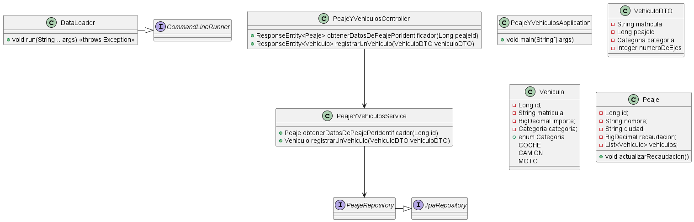

# Repositorio de Práctica: API REST con Spring Boot

Este repositorio contiene una implementación práctica de una API REST utilizando Spring Boot. A continuación, se describen las principales características y funcionalidades del proyecto.

## Descripción del Proyecto

- Maneja entidades **`Peaje`** y **`Vehículo`**.
- Realiza operaciones en cascada sobre una base de datos en memoria **H2**, a través de la entidad dominante (**`Peaje`**).
- Hace una insercion de datos con los que poder trabajar al arrancar la aplicacion
- Establece dos endpoints para:
  1. Registrar un vehículo que ha pasado por un peaje.
  2. Consultar la información de un peaje según su ID, incluyendo los datos de todos los vehículos que han pasado por él.
- Cada vez que se añade un vehículo mediante la aplicación se actualiza la **recaudación total del peaje correspondiente**.
- **Testeado con pruebas de integración.**

---

## Requisitos del Proyecto

### Objetivo
Desarrollar un sistema que modele el funcionamiento de un **peaje**. Las estaciones de peaje deben cumplir las siguientes especificaciones:

1. **Estaciones de Peaje**:
   - Cada estación tiene un nombre, la ciudad donde está ubicada y un valor numérico que representa el total del peaje recolectado.

2. **Vehículos**:
   - Los vehículos que llegan al peaje tienen una **placa de matriculación**.
   - El valor del peaje depende del tipo de vehículo:
     - **Coche**: $100.
     - **Moto**: $50.
     - **Camión**: $50 por cada eje.

3. **Funcionalidades**:
   - La estación de peaje debe:
     - Calcular el valor del peaje correspondiente para cada vehículo.
     - Mantener un registro del total de peajes recolectados.
     - Al finalizar, imprimir un listado con:
       - Los vehículos que llegaron al peaje.
       - El total acumulado de peajes recolectados.

---

## Diagrama UML

A continuación, se presenta un **diagrama UML** que describe la estructura de clases del proyecto:

